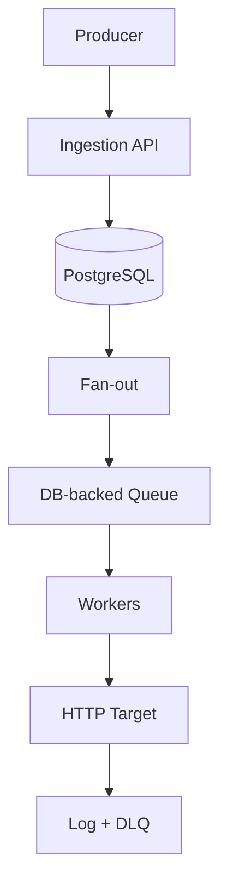

# Notification Service 🗿

Reliable, asynchronous event delivery system built with Node.js, Express, Prisma and PostgreSQL.

A terminal-first backend service that ingests events and delivers them to subscribed endpoints using asynchronous processing and clear delivery guarantees.

---

## 🚀 Overview

This service simulates a real-world notification/webhook system.

It supports:

* Event ingestion via REST API
* Subscription-based fan-out
* Asynchronous delivery (queue-based)
* Retry with exponential backoff
* At-least-once delivery guarantees
* Idempotency (ingestion + delivery)
* Delivery logging
* Dead Letter Queue (DLQ)

Built as a system design playground for scalability, reliability and failure handling.

---

## 🧱 Architecture



---

## 🛠 Tech Stack

* Node.js
* Express
* TypeScript
* Prisma ORM
* PostgreSQL (Docker)

---

## 📦 Core Concepts

### Event

Represents something that happened in the system.

**Example:**

```bash
curl -X POST http://localhost:3000/events \
  -H "Content-Type: application/json" \
  -H "Idempotency-Key: optional-unique-key" \
  -d '{"type": "user.created", "payload": {"userId": "123"}}'
```

Stored in database with unique ID and timestamp.

### Subscription

Defines which endpoint receives which event types.

```bash
# Create
curl -X POST http://localhost:3000/subscriptions \
  -H "Content-Type: application/json" \
  -d '{"endpoint": "https://example.com/webhook", "eventTypes": ["user.created", "order.placed"]}'

# List
curl http://localhost:3000/subscriptions

# Get by id
curl http://localhost:3000/subscriptions/:id

# Update
curl -X PATCH http://localhost:3000/subscriptions/:id \
  -H "Content-Type: application/json" \
  -d '{"endpoint": "https://new-url.com/webhook", "eventTypes": ["user.deleted"], "active": false}'

# Delete
curl -X DELETE http://localhost:3000/subscriptions/:id
```

### Delivery

Represents a delivery attempt of one event to one subscription.

```bash
# List deliveries (optional ?status=pending|delivered|failed|dlq)
curl http://localhost:3000/deliveries
curl "http://localhost:3000/deliveries?status=dlq"

# Dead letter queue
curl http://localhost:3000/deliveries/dlq

# Get delivery with logs
curl http://localhost:3000/deliveries/:id
```

---

## 🔒 Guarantees

* Delivery model: at-least-once
* Ordering: not guaranteed
* Ingestion idempotency supported
* Delivery deduplication via unique delivery key

---

## 🔁 Retry Strategy

* Exponential backoff
* Configurable max attempts (`DELIVERY_MAX_ATTEMPTS`, default 5)
* Failed deliveries moved to DLQ

Env vars: `WORKER_POLL_MS`, `BACKOFF_BASE_MS`, `DELIVERY_MAX_ATTEMPTS` (see `.env.example`)

---

## 📊 Observability

* `/health` endpoint
* Delivery logs stored in database (`DeliveryLog` model)
* Deliveries API for inspection (`/deliveries`, `/deliveries/dlq`, `/deliveries/:id`)

---

## ⚖️ Trade-offs

### DB-backed Queue (MVP)

**Pros**

* Simple setup
* No additional infrastructure

**Cons**

* Limited scalability under high contention

**Future upgrade**

* Replace DB queue with SQS / Kafka / RabbitMQ for high-throughput workloads

---

## 🧪 Local Development

```bash
# 1. Start PostgreSQL
docker compose up -d

# 2. Copy env and run migrations
cp .env.example .env
npm run db:migrate

# 3. Start API server (terminal 1)
npm run dev

# 4. Start worker (terminal 2)
npm run worker

# 5. Create subscription and send events
curl -X POST http://localhost:3000/subscriptions \
  -H "Content-Type: application/json" \
  -d '{"endpoint": "https://webhook.site/your-id", "eventTypes": ["user.created"]}'

curl -X POST http://localhost:3000/events \
  -H "Content-Type: application/json" \
  -H "Idempotency-Key: optional-unique-key" \
  -d '{"type": "user.created", "payload": {"userId": "123"}}'

# Inspect deliveries and DLQ
curl http://localhost:3000/deliveries
curl http://localhost:3000/deliveries/dlq
```

---

## 🎯 Why This Project?

This project explores:

* Event-driven architecture
* Asynchronous system design
* Retry and backoff strategies
* Delivery guarantees
* Horizontal scalability patterns
